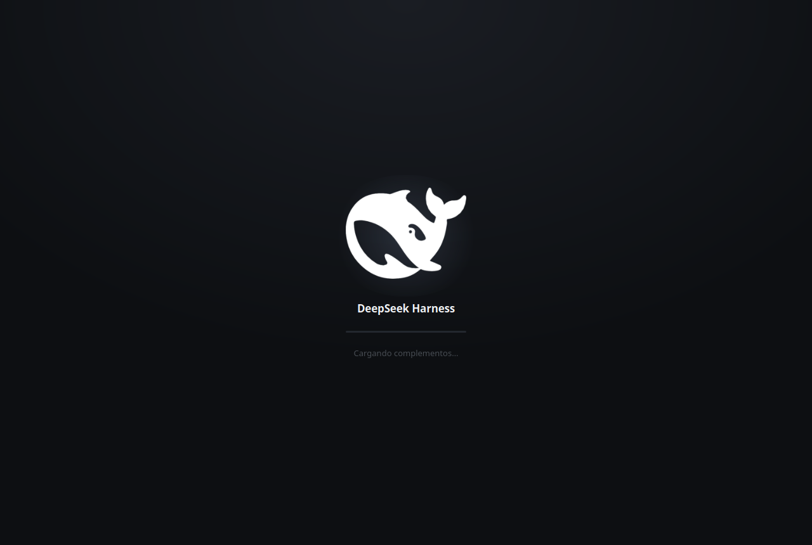

# DeepSeek Harness Desktop

[English](README.md) · **Español** · [Português](README.pt.md)

Aplicación de escritorio para [DeepSeek Harness](https://www.deepseek.com/harness/):
arranca el servidor local, muestra una pantalla de carga y abre la interfaz en
una ventana propia, **sin navegador**.

> DeepSeek no publica cliente para Linux (solo macOS `.dmg` y Windows `.exe`).
> Este proyecto cubre ese hueco con Tauri + WebKitGTK.



## Instalación

### Opción A — Paquete `.deb`

Descarga el `.deb` desde [Releases](../../releases) e instálalo:

```bash
sudo apt install ./dsh-desktop_0.1.0_amd64.deb
```

Aparecerá **DeepSeek Harness** en el menú de aplicaciones. Para desinstalarlo:

```bash
sudo apt remove deep-seek-harness
```

### Opción B — Instalador local (sin root)

```bash
git clone https://github.com/vicman/deepseek-harness-desktop
cd deepseek-harness-desktop
./instalar.sh
```

Todo queda en `~/.local`. También acepta `--deb` (genera el paquete) y
`--desinstalar`.

## Requisitos

| Componente | Versión | Instalación |
|---|---|---|
| Rust | ≥ 1.77 | `curl https://sh.rustup.rs -sSf \| sh` |
| WebKitGTK | 4.1 | `sudo apt install libwebkit2gtk-4.1-dev` |
| Node.js | **≥ 22** | `nvm install 24` |
| `dsh` | 0.2.0-rc.2 | **automático** (ver abajo) |

> **Node importa.** DSH usa `node:util.parseEnv`, que no existe en Node 18.
> La aplicación busca por su cuenta la versión más reciente de nvm.

El `.deb` ya declara `libwebkit2gtk-4.1-0` y `libgtk-3-0`. Node lo instalas tú.

### Gestión de DSH

La aplicación **no lleva DSH incrustado**: lo resuelve en cada arranque, así
que nunca se queda con una copia vieja.

- **Si DSH no está instalado**, la aplicación lo instala sola al arrancar
  (`pnpm add -g`, con `npm install -g` como respaldo). La pantalla de carga
  muestra *«Instalando DeepSeek Harness…»* mientras tanto.
- **Si hay una versión más nueva publicada**, la pantalla de carga lo avisa
  con el comando para actualizar.

**No actualiza sola.** Instalar software en segundo plano sin pedir permiso
es una decisión tuya, no de la aplicación: solo informa y tú ejecutas:

```bash
pnpm add -g @deepseek-ai/dsh
```

Para comprobar la versión instalada frente a la publicada:

```bash
dsh --version
npm view @deepseek-ai/dsh version
```

## Idiomas

La interfaz está en **español, inglés y portugués**. El idioma se elige solo,
en este orden:

1. El idioma del equipo (`LANG`, `LC_MESSAGES`, `LC_ALL`) — p. ej. `es_CO.UTF-8`.
2. Los idiomas preferidos de tu navegador.
3. **Español por defecto** si ninguno de los tres coincide.

## Cómo funciona

```
dsh-desktop
   │
   ├─ 1. Sirve la pantalla de carga en 127.0.0.1:<puerto libre>
   │
   ├─ 2. Arranca `dsh web --port 3081` como proceso hijo
   │
   ├─ 3. Espera a que el servidor responda de verdad (petición HTTP real)
   │
   ├─ 4. Navega con el token; el webview guarda la cookie
   │
   └─ 5. Al cerrar la ventana, termina el proceso hijo
```

### Decisiones de diseño

**El puerto está fijado en 3081.** La cookie de sesión de DSH lleva firmado el
`host:puerto` (`authority`). Con puerto aleatorio se acumulan cookies de
sesiones muertas bajo `127.0.0.1` y el servidor responde `401`. Si el 3081 está
ocupado se busca otro libre.

**La pantalla de carga se sirve desde `127.0.0.1`, no desde `tauri://`.** La
cookie de DSH es `SameSite=Strict`: si el splash viniera del esquema interno,
la navegación posterior sería entre sitios distintos y el navegador **no
enviaría la cookie** (página en blanco con error `401`).

**Se desactiva el renderizador DMABUF de WebKitGTK.** Con GPU NVIDIA, WebKitGTK
aborta con `Could not create GBM EGL display: EGL_NOT_INITIALIZED`. La
aplicación define `WEBKIT_DISABLE_DMABUF_RENDERER=1` por su cuenta.

## Personalización

`ui/splash.html` se lee **en tiempo de ejecución**, así que puedes cambiar
colores, textos o el logotipo y reabrir la aplicación — sin recompilar.

## Compilar

```bash
cd src-tauri
cargo build --release            # binario
cargo tauri build --bundles deb  # paquete .deb
```

## Problemas conocidos

**Se queda en blanco o da error 401.** Suele ser una cookie caducada:

```bash
rm -f ~/.local/share/com.vicmandev.dsh.desktop/cookies
```

**Destello blanco breve** entre la pantalla de carga y la interfaz (~1 s).
Es WebKit pintando su lienzo mientras carga. Pendiente de resolver.

**No pasa del splash.** Comprueba `dsh --version` y que Node sea ≥ 22.

## Estructura

```
.
├── instalar.sh              instalador / desinstalador
├── ui/
│   ├── splash.html          pantalla de carga (editable sin recompilar)
│   └── logo-splash.png      logotipo, fondo transparente
├── debian/                  copyright y changelog del paquete
└── src-tauri/
    ├── src/main.rs          arranque, splash y navegación
    ├── tauri.conf.json
    └── icons/
```

## Licencia

MIT. El logotipo de DeepSeek Harness es marca de DeepSeek y se usa únicamente
para identificar la aplicación.

---

Autor: **Victor Manuel Agudelo** &lt;vicmandev@gmail.com&gt;
